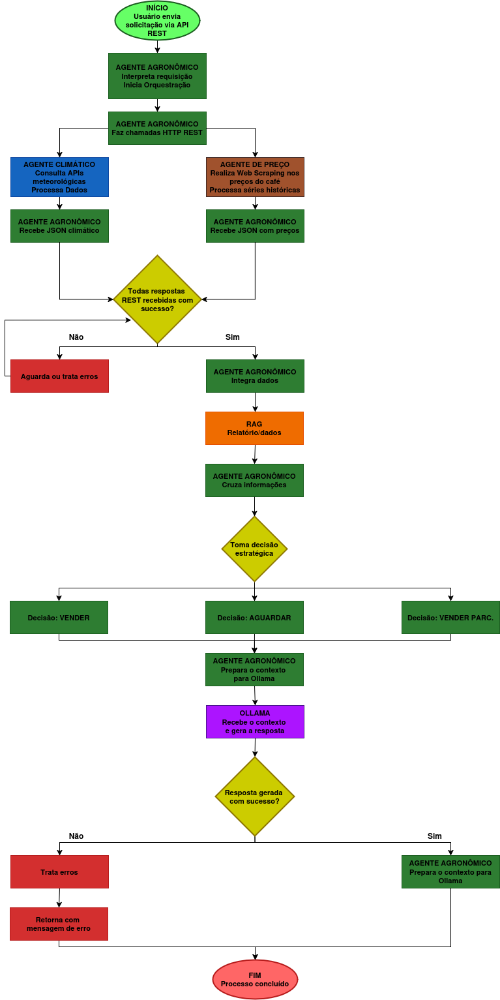
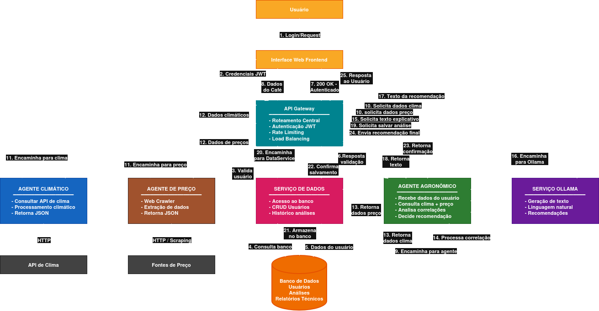

# ☕ Sistema Distribuído de Análise Climática, de Preço e Decisão Agronômica na Cafeicultura

### 🧠 Projeto de Sistemas Distribuídos — UFLA  
**Autores:**  
- Gabriel Jardim de Souza  
- Kauê de Oliveira Silva  
- Paulo Henrique Dos Anjos Silveira  
- Thiago Ferreira Azevedo  

---

## 📄 Descrição

Este projeto propõe um **sistema distribuído de apoio à decisão** para produtores de café, integrando **dados climáticos**, **séries de preços** e **informações agronômicas**.  
O objetivo é **gerar recomendações automáticas** sobre o melhor momento para venda da safra, com base em dados históricos e previsões.  

O sistema é composto por **múltiplos agentes autônomos** que coletam, processam e analisam informações de fontes externas (APIs, sites e relatórios técnicos), retornando uma **análise explicável e centralizada** para o usuário final.  

---

## 🚀 Funcionalidades principais

- 🌤️ **Coleta climática automática** via APIs (Open-Meteo, OpenWeatherMap, INMET, etc.)  
- 💰 **Coleta de preços** da saca de café em fontes como CEPEA, B3 e ICO  
- 🌱 **Análise agronômica** baseada em relatórios e indicadores técnicos  
- 🧾 **Geração de recomendações** textuais e interpretáveis (ex.: *“Tendência de valorização devido à estiagem”*)  
- 🗄️ **Armazenamento e histórico** de dados climáticos e financeiros  
- ⚙️ **Arquitetura modular e distribuída**, com cada agente em container próprio  

---

## 🏗️ Arquitetura

A arquitetura é baseada em **microserviços containerizados**, onde cada agente desempenha uma função específica e se comunica via **API REST**.  

### 🔹 Componentes principais

- **Agente Climático:** consome APIs climáticas (como Open-Meteo, INMET, OpenWeather), coleta previsões de tempo e retorna um JSON padronizado.  
- **Agente de Preços:** realiza scraping ou consultas a APIs de preços (CEPEA, B3, ICO) e retorna dados estruturados em JSON.  
- **Agente Agronômico:** integra as informações de clima e preço, interpreta relatórios técnicos e, com apoio de um modelo de linguagem, gera recomendações explicáveis para o produtor.  
- **Ollama (LLM Local):** executa modelos de linguagem (ex.: Llama 3, Mistral, Phi) de forma **local e privada**, permitindo que o **Agente Agronômico** utilize processamento de linguagem natural   (NLP) e geração de texto sem depender de APIs externas.  
- **Banco de Dados / Storage:** armazena históricos climáticos, séries de preços, relatórios e logs de execução.  
- **API Gateway / Frontend:** expõe os resultados dos agentes, centraliza as requisições e gerencia autenticação e segurança.  

---
## 🧩 Fluxograma / Data Flow

---

## 🏗️ Arquitetura

## 🧠 Justificativa da Arquitetura
---

---
