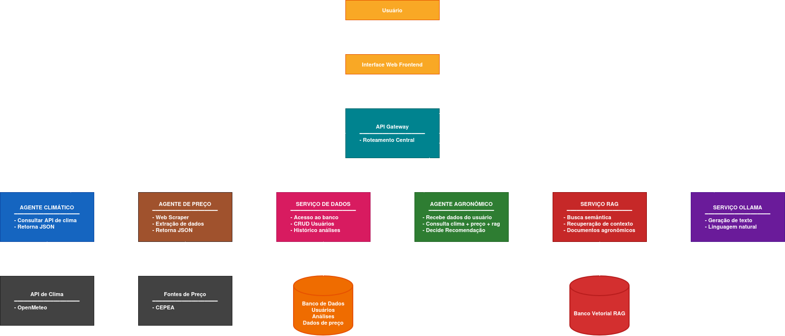
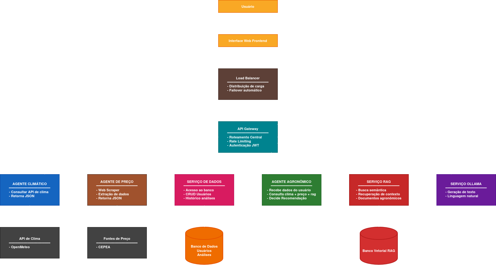

# ☕ Sistema Distribuído de Análise Climática, de Preço e Decisão Agronômica na Cafeicultura

### 🧠 Projeto de Sistemas Distribuídos — UFLA  
**Autores:**  
- Gabriel Jardim de Souza  
- Kauê de Oliveira Silva  
- Paulo Henrique Dos Anjos Silveira  
- Thiago Ferreira Azevedo  

---

## 1. ❗ A Dor que o Sistema Pretende Resolver

Apesar da relevância e abundância de informações climáticas, agronômicas e de mercado, os produtores e cooperativas **não têm acesso a uma ferramenta unificada** que integre todos esses dados e gere recomendações práticas.

A dor central é:

### **→ Produtores e cooperativas não conseguem tomar decisões rápidas e precisas sobre o melhor momento de vender ou manejar a lavoura devido à falta de integração entre clima, preços e condições agronômicas.**

Essa dor se desdobra em problemas reais identificados:

- Dados climáticos estão espalhados entre INMET, Open-Meteo, institutos regionais e previsões globais.  
- Dados de preço estão fragmentados em CEPEA, B3, ICO e relatórios diversos.  
- A instabilidade climática recente tornou a tomada de decisão muito arriscada.  
- Erros de timing na venda resultam em perda financeira significativa.  
- Pequenos produtores sofrem ainda mais pela falta de acesso a análise técnica.

Hoje, as decisões sobre venda, colheita, manejo e planejamento ainda são feitas de forma manual, empírica ou baseada em informações desatualizadas — exatamente o ponto que o nosso sistema distribuído automatiza.

---

## 2. 🧩 Validação do Problema

A cafeicultura brasileira enfrenta, na última década, um cenário crescente de instabilidade causado por mudanças climáticas e oscilações bruscas do mercado. Estudos recentes demonstram que eventos extremos como geadas, estiagens prolongadas e chuvas intensas têm afetado diretamente a produtividade do café (Reis et al., 2025).

Segundo o estudo **"Impacto das Mudanças Climáticas na Produção e nos Custos do Café no Brasil"**, os efeitos climáticos extremos foram responsáveis por perdas significativas na produção, especialmente nas safras de 2020, 2021 e 2023, causando:

- Reduções abruptas na produtividade do arábica  
- Aumento dos custos de produção  
- Necessidade de replantio e irrigação emergencial  
- Mudança forçada de regiões produtivas

O relatório destaca que eventos como a **geada de 2021** comprometeram cerca de **20% da safra**, enquanto secas associadas a **El Niño** e **La Niña** provocaram quebras que pressionaram o mercado. A consequência econômica foi imediata: o preço da saca de 60 kg atingiu **R$ 2.504,53 em 2025**, o maior valor em décadas, segundo dados do CEPEA (2025) incluídos no estudo.

Além da variabilidade climática, há também forte instabilidade no mercado nacional e internacional, influenciado por:

- Expectativa de oferta global  
- Câmbio  
- Estoques internacionais  
- Condições meteorológicas no cinturão do café

O documento evidencia ainda a vulnerabilidade de **pequenos e médios produtores**, que possuem menor acesso a tecnologias de monitoramento climático, dados de mercado e assistência técnica — exatamente o público mais prejudicado pela ausência de ferramentas integradas de apoio à decisão.

Portanto, os dados apontam para um problema real, comprovado e atual: a produção e a precificação do café no Brasil tornaram-se altamente dependentes de condições ambientais instáveis, exigindo métodos modernos de análise, monitoramento contínuo e suporte automatizado para tomada de decisão.

---

## 3. ⚙️ Como o Sistema Resolve Essa Dor

O projeto desenvolvido aplica **agentes distribuídos de IA**, cada um especializado em um domínio crítico (clima, preço e agronomia), capazes de:

- Coletar dados automaticamente  
- Cruzar informações em tempo real  
- Gerar análises explicáveis via LLM local (Ollama)  
- Produzir recomendações objetivas sobre o melhor momento de venda  
- Reduzir risco e incerteza para o produtor

Isso transforma um ambiente caótico de dados desconectados em uma **análise estruturada, centralizada e acionável**, melhorando decisões e reduzindo perdas.

---

## 4. 📄 Descrição

Este projeto propõe um **sistema distribuído de apoio à decisão** voltado à **cafeicultura**, integrando dados **climáticos**, **de mercado** e **agronômicos** para auxiliar produtores e cooperativas a definirem **o melhor momento de venda da safra**.

A solução utiliza **múltiplos agentes inteligentes**, implementados como **microserviços autônomos**, que coletam, processam e cruzam informações de fontes externas (APIs e relatórios técnicos).  
O resultado final é uma **análise explicável**, entregue de forma integrada e segura ao usuário via **API Gateway**.

---

## 5. 🚀 Funcionalidades Principais

- 🌤️ **Coleta climática automática** via API (Open-Meteo)  
- 💰 **Coleta de preços** da saca de café (CEPEA)  
- 🌱 **Análise agronômica integrada**, considerando clima, preços e relatórios técnicos  
- 🧾 **Geração de recomendações textuais explicáveis** 
- 🗄️ **Armazenamento histórico** de usuários e análises
- ⚙️ **Arquitetura modular e distribuída**, com cada agente containerizado em Docker  

---

## 6. 🏗️ Arquitetura do Sistema

### 6.1. Arquitetura Pré-Modelagem de Ameaças

A arquitetura inicial foi projetada como **orientada a microserviços** para funcionar de forma **distribuída e orquestrada via REST**. Cada agente atua de maneira independente, mas integrada através de um **API Gateway**, que realiza o **roteamento e comunicação entre os serviços**.

### 6.2. 🔒 Modelagem de Ameaças

Para garantir a segurança do sistema, foi realizada uma análise detalhada de ameaças seguindo a metodologia STRIDE. [Clique aqui para acessar a Modelagem de Ameaças completa](./modelagem_ameacas/modelagem_ameacas.md)

### 6.3. Arquitetura Pós-Modelagem de Ameaças

Após a análise de segurança, a arquitetura foi reforçada com:

- **Autenticação JWT** com refresh tokens
- **Rate limiting** no API Gateway
- **Load balancer** no API Gateway

---

## 7. 🧠 Justificativa da Arquitetura

A arquitetura proposta segue o padrão de **sistemas distribuídos baseados em agentes IA e microserviços**, garantindo **modularidade, resiliência e escalabilidade**. A comunicação entre os módulos é realizada via **API REST**, simplificando a integração e permitindo que cada agente possa ser desenvolvido e implantado de forma independente.

Essa abordagem reflete um modelo **orientado à responsabilidade funcional**, em que cada componente é especializado em uma função do domínio e se comunica por meio de um gateway centralizado.

### 7.1. Estrutura e Papéis dos Componentes

| **Componente** | **Responsabilidade Principal** |
|----------------|--------------------------------|
| 👨‍🌾 **Usuário / WebUI** | Interface de acesso usada por usuários. Envia requisições e exibe resultados. |
| ⚖️ **Load Balancer** | Distribuição inteligente de carga e failover automático entre instâncias. |
| 🚪 **API Gateway** | Ponto único de entrada e roteamento. Gerencia autenticação e redireciona requisições REST entre agentes. |
| 🌱 **Agente Agronômico** | Atua como **núcleo lógico de decisão**. Recebe solicitações via Gateway, requisita relatórios do RAG e dados dos agentes de clima e preço (por meio do Gateway), integra os resultados e decide recomendações. |
| 🔍 **Serviço RAG** | Busca semântica em documentos agronômicos via Banco Vetorial. |
| 💾 **Serviço de Dados** | Autenticação, CRUD de usuários e gerenciamento de histórico de análises. |
| 🌤️ **Agente Climático** | Consome API meteorológica (Open-Meteo), processa e retorna dados estruturados sobre temperatura, precipitação, umidade e intensidade do vento. |
| 💰 **Agente de Preço do Café** | Realiza scraping na fonte CEPEA, processa e retorna dados de preço dos últimos 90 dias. |
| 🧠 **Serviço Ollama (LLM Local)** | Modelo de linguagem local (Ollama) executado em container, responsável por gerar textos explicativos com base no contexto do Agente Agronômico. |
| 🗄️ **Banco de Dados** | Armazena análises e dados do usuário. |
| 🧩 **Banco Vetorial RAG** | Armazena embeddings de documentos técnicos. |

### 7.2. Comunicação e Integração

A integração entre os agentes ocorre via **API Gateway**, utilizando o protocolo **HTTP REST** e mensagens **JSON padronizadas**.

O **Gateway** centraliza a comunicação e executa funções de:  
- Controle de requisições  
- Encaminhamento entre serviços  
- Balanceamento e segurança

**Vantagens dessa abordagem:**
- Baixo acoplamento entre serviços  
- Escalabilidade horizontal
- Independência de desenvolvimento e deploy  
- Facilita o monitoramento e logging centralizado  

### 7.3. Justificativa Técnica

- **Microserviços containerizados:** garantem isolamento, escalabilidade e facilidade de implantação  
- **Gateway como mediador:** centraliza segurança, controle e comunicação entre agentes   
- **Modelo de IA local (Ollama):** atende ao requisito de conter um modelo de IA local containerizado  
- **REST + JSON:** formato padrão, interoperável e simples de integrar  
- **Facilidade de expansão:** novos agentes (por exemplo, de solo ou pragas) podem ser adicionados sem refatorar o sistema principal

---

## 8. 🔒 Segurança e Confiabilidade

- Autenticação e autorização via tokens JWT no Gateway
- Sanitização e validação de entradas de usuário  
- Rate limiting para prevenção de DDoS  

---

## 9. 📚 Referência

REIS, Jhara Costa; COSTA, Maria Claudia Coutinho da; MATHIAS, Natalie Nascimento; PASSOS, Nicole Magalhães. *Impacto das mudanças climáticas na produção e nos custos do café no Brasil.* São Roque: Centro Paula Souza – Faculdade de Tecnologia de São Roque "Dr. Bernardino de Campos", 1º semestre de 2025.
