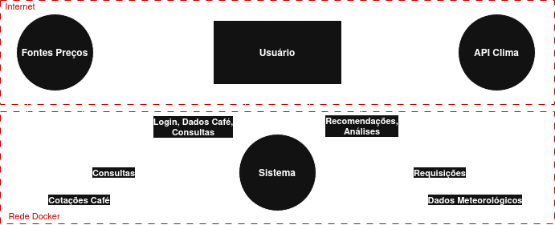
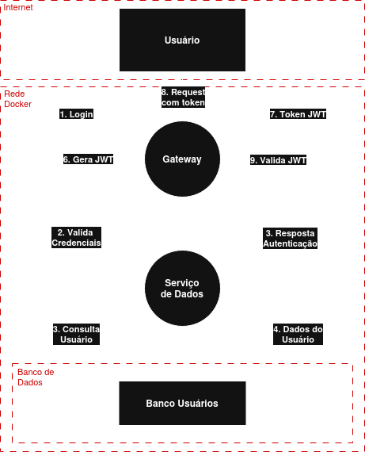
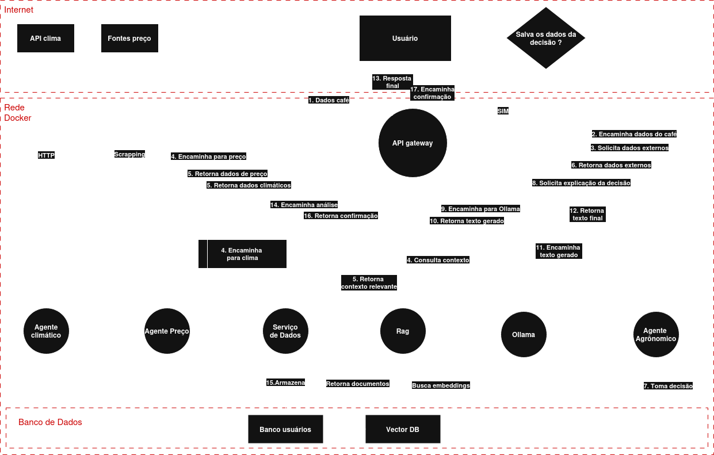

# Modelagem de Ameaças - AgroAnalytics

## 🧠 Metodologia STRIDE Aplicada

### **Categorias de Ameaças:**
1. **S**poofing (Falsificação de identidade)
2. **T**ampering (Manipulação de dados)
3. **R**epudiation (Repúdio)
4. **I**nformation Disclosure (Divulgação de informações)
5. **D**enial of Service (Negação de serviço)
6. **E**levation of Privilege (Elevação de privilégio)

---

## 🗺️ Diagramas de Fluxo de Dados (DFD)

### DFD 0: Diagrama de Contexto

### DFD 1: Autenticação e Gerenciamento de Usuários

### DFD 2: Análise Agronômica

---

## 📊 Análise de Ameaças e Mitigações

| ID | Vulnerabilidade | DFD (Seta) | STRIDE | Descrição Ameaça | Probabilidade | Impacto | Risco | Medida de Segurança | Prob Res | Impacto Res | Risco Res |
|----|---|---|---|---|:---:|:---:|:---:|---|:---:|:---:|:---:|
| 1 | Falsificação de Identidade | Usuário → API Gateway | Spoofing | Invasor se passa por usuário legítimo usando credenciais roubadas | 20 | 20 | 400 | Autenticação JWT  | 5 | 15 | 75 |
| 2 | Abuso de API / Brute Force | Usuário → API Gateway | DoS | Ataque com múltiplas requisições para força bruta ou consumo de recursos | 15 | 15 | 225 | Rate Limiting  | 5 | 10 | 50 |
| 3 | Acesso a Dados de Outros Usuários | API Gateway → DataService | Elevation of Privilege | Usuário manipula parâmetros para listar análises, histórico e dados privados de outros usuários | 15 | 20 | 300 | Autorização de API  | 5 | 15 | 75 |
| 4  | JSON Injection / Dados Malformados | Gateway → Clima/Preço/RAG Services | Tampering | Dados malformados, manipulados ou incompletos enviados por APIs externas comprometem o fluxo | 10 | 15 | 150 | Sanitização nos serviços internos (validação rígida de JSON) | 5 | 10 | 50 |
| 5 | Falha de Serviço de Clima | ClimaService → WeatherAPI | DoS | API de clima indisponível causando falha total na análise agronômica | 15 | 20 | 300 | Redundância para API de Clima  | 5 | 15 | 75 |
| 6 | Vazamento de Dados de Análises | Usuário → WebUI ← APIGateway | Information Disclosure | Histórico de análises agronômicas interceptado em requisições HTTP sem proteção adequada | 10 | 15 | 150 | Sanitização de Dados + TLS  | 5 | 12 | 60 |
| 7 | Ataque DDoS na API | Usuário → API Gateway | DoS | Ataque distribuído massivo sobrecarregando o gateway e indisponibilizando o serviço | 20 | 20 | 400 | Load Balancer com distribuição de tráfego | 10 | 18 | 180 |
| 8 | Acesso Direto ao Banco de Dados | DataService → DB | Information Disclosure | Tentativa de acesso direto ao banco de dados via credenciais expostas ou bypass de gateway | 5 | 20 | 100 | Isolamento de rede e firewall | 5 | 18 | 90 |
| 9 | Falsificação de Preços Agrícolas | PrecoService → ICO | Tampering | Manipulação de dados de preço extraídos para enviesar recomendações de venda/compra | 10 | 15 | 150 | Verificação com múltiplas fontes de dados | 5 | 12 | 60 |
| 10 | Repúdio de Ações | Todos os serviços | Repudiation | Usuário nega ter solicitado uma análise sem logs adequados para rastreamento | 10 | 10 | 100 | Sistema de logs centralizado e auditoria | 5 | 8 | 40 |
| 11 | Vazamento de Credenciais | Usuário | Spoofing | Roubo de credenciais através de phishing ou vazamento de dados de terceiros | 15 | 15 | 225 | Detecção de atividades suspeitas | 10 | 12 | 120 |

---

## 📊 Matriz de Priorização de Ameaças

| Impacto / Probabilidade | Baixa (5) | Média (10) | Alta (15) | Crítica (20) |
|-------------------------|-----------|------------|-----------|--------------|
| **Baixo (5)**           | 25        | 50         | 75        | 100          |
| **Médio (10)**          | 50        | 100        | 150       | 200          |
| **Alto (15)**           | 75        | 150        | 225       | 300          |
| **Crítico (20)**        | 100       | 200        | 300        | 400          |

---

### **Classificação por Nível de Risco:**

- #### **CRÍTICA (Score: 251–400)**

- #### **ALTA (Score: 151–250)**

- #### **MÉDIA (Score: 76–150)**

- #### **BAIXA (Score: 1–75)**

---

## 🛡️ Medidas de Segurança Implementadas

- #### Autenticação JWT (IMPLEMENTADO)

    Validação de identidade dos usuários através de tokens JWT no API Gateway. Garante que apenas usuários autenticados possam acessar os serviços.

- #### Rate Limiting (IMPLEMENTAR)

    Limitação de requisições por usuário/IP no API Gateway. Protege contra DDoS, abuso de API e ataques de brute force.

- #### Autorização de API (IMPLEMENTAR)

    Controle de permissões e escopos no API Gateway. Impede acesso a recursos não permitidos e garante isolamento entre dados de usuários.

- #### Sanitização de Dados (IMPLEMENTAR)

    Filtragem e validação de inputs no API Gateway. Protege contra SQL Injection, XSS e injeção de dados em análises.

- #### Load Balancer no Gateway (IMPLEMENTAR)

    Implementação de um mecanismo de balanceamento de carga no próprio Gateway, distribuindo requisições entre múltiplas instâncias e reduzindo o impacto de ataques DDoS e sobrecarga.